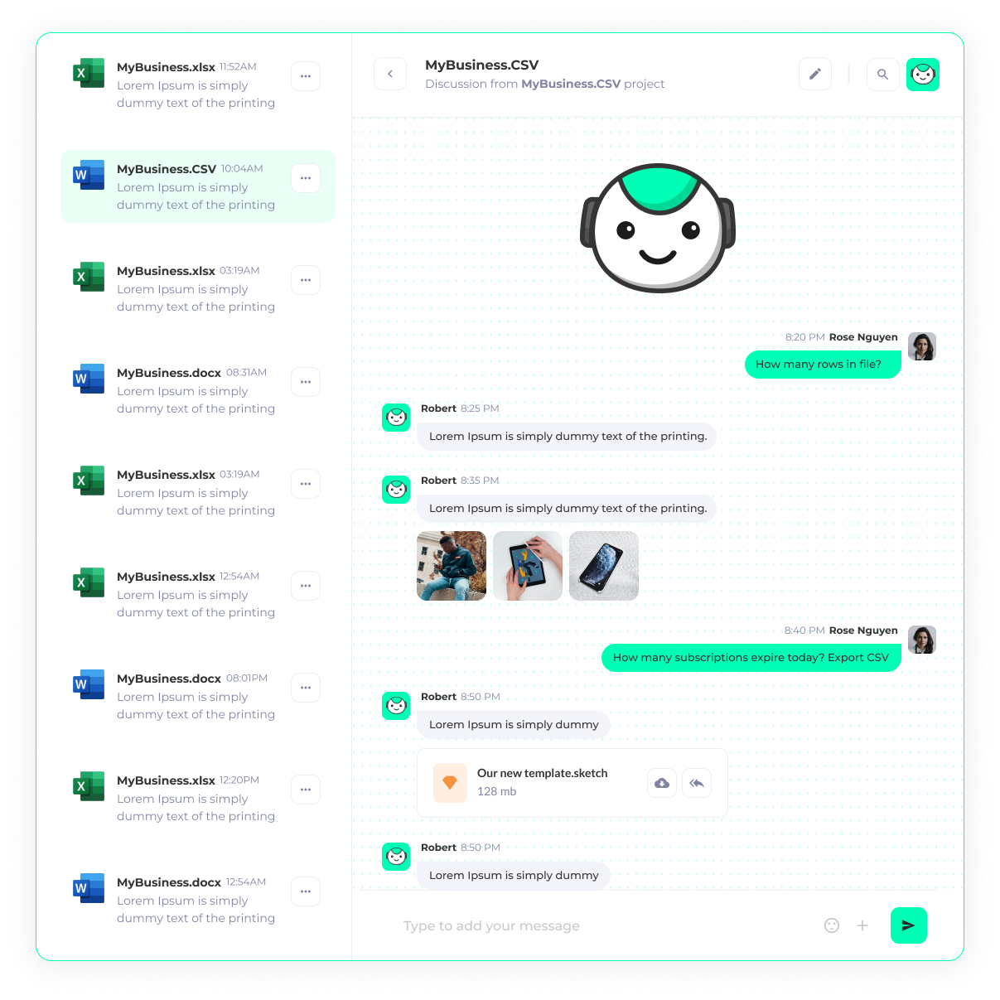
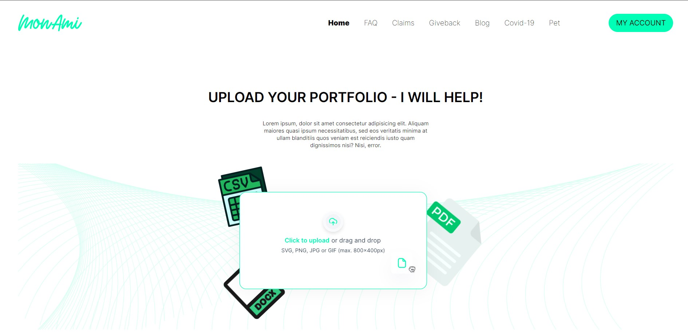
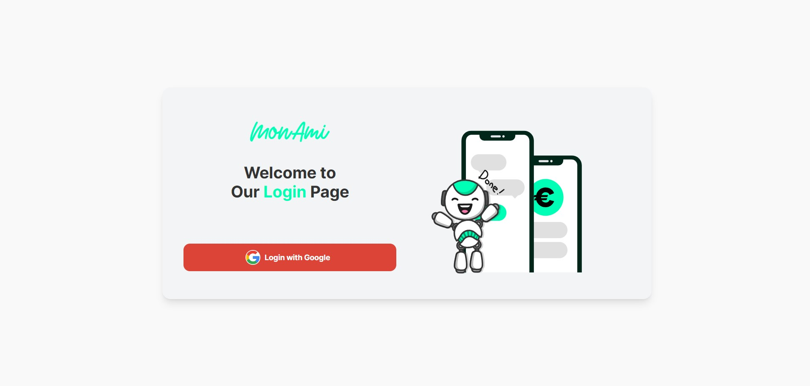

# WAFI ChatBot

## Overview
WAFI ChatBot leverages the power of GPT-4 and fine-tuned models to deliver detailed analysis and insights on financial files. Designed to provide valuable recommendations, this system is an essential tool for anyone involved in financial analysis and decision-making.

## Features
- **Advanced Financial Analysis**: Utilizes GPT-4 and fine-tuned models to analyze financial files and provide in-depth insights.
- **Interactive User Experience**: Engaging animations create an intuitive and smooth interaction with the chatbot.
- **Real-Time Recommendations**: Delivers timely and accurate recommendations based on the latest data.
- **Google Gmail SSO**:  Facilitates easy and secure user login through Google Gmail Single Sign-On (SSO).

## Tech Stack
- **Next.js**: For server-side rendering and static site generation.
- **Axios**: For making HTTP requests to the backend.
- **Material UI**: For modern and responsive UI components.
- **Redux Toolkit**: For state management.
- **Tailwind CSS**: For utility-first CSS styling.

## UI Screenshot

## License

This project is licensed under the MIT License - see the [LICENSE](LICENSE) file for details.